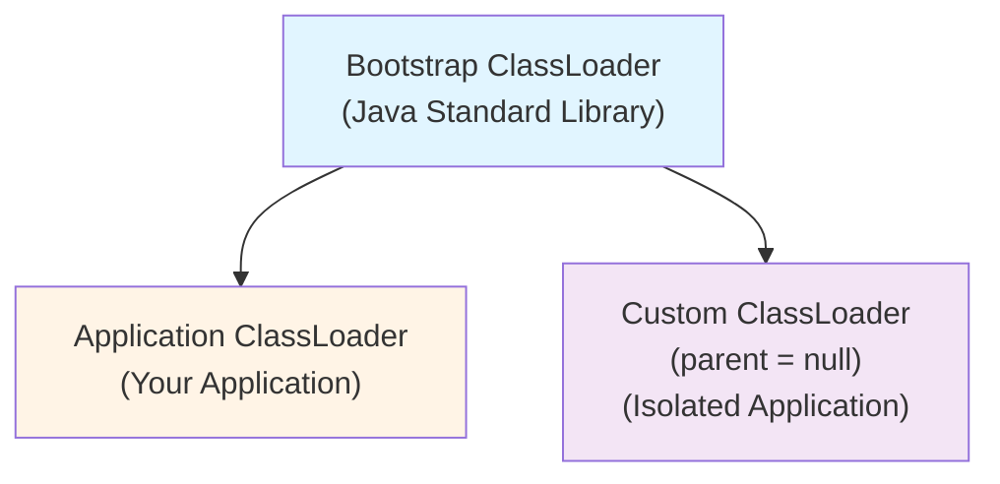
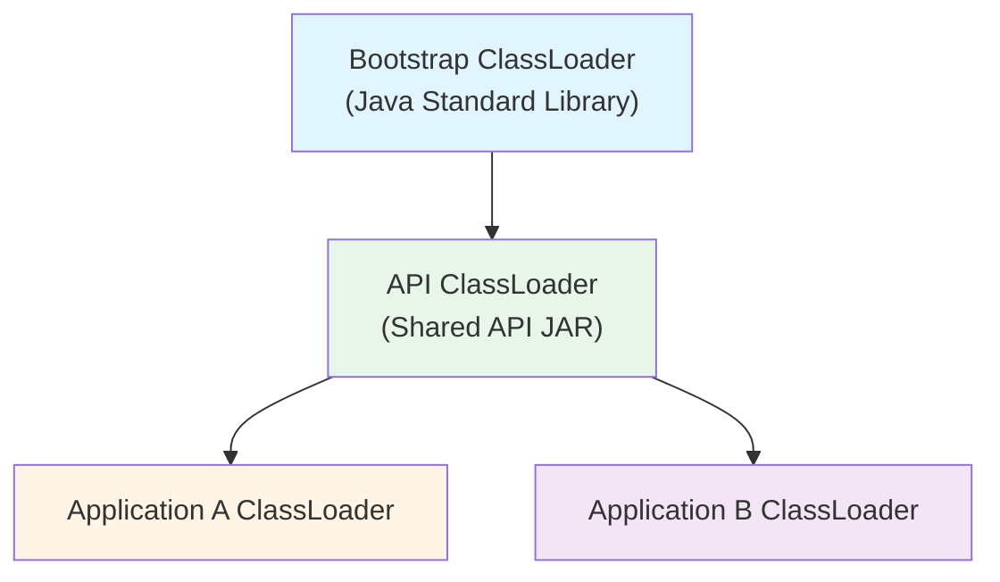

# When Your IntelliJ Plugin Works in Tests but Fails in Production

**Date:** February 12, 2026  
**Author:** Eugene Petrenko  
**Tags:** jvm, classloading, intellij, plugin-development, java

---

If your IntelliJ plugin works in tests but fails in production with `LinkageError`,
`ClassCastException`, or plugin conflicts, you are likely hitting a classloader boundary problem.
Let's walk through what actually happens and how to stay safe.

## Table of Contents

- [Foundation: How JVM Classloading Works](#foundation-how-jvm-classloading-works)
  - [Basic Classloaders](#basic-classloaders)
  - [Duplicate Dependencies](#duplicate-dependencies)
  - [How It Works](#how-it-works)
- [IntelliJ Plugin Classloading](#intellij-plugin-classloading)
  - [Plugin Classloader Architecture](#plugin-classloader-architecture)
- [Kotlin Libraries in Plugins](#kotlin-libraries-in-plugins)
  - [Why Kotlin Libraries Are Special](#why-kotlin-libraries-are-special)
  - [Build-Time Verification](#build-time-verification)
- [Common Isolation Patterns](#common-isolation-patterns)
  - [Shadow JAR and Relocation](#shadow-jar-and-relocation)
  - [Independent Classloader Hierarchies](#independent-classloader-hierarchies)
- [Testing and Classloaders](#testing-and-classloaders)
  - [Why Test Runtime Differs from Production](#why-test-runtime-differs-from-production)
  - [Test Fixtures and Dependencies](#test-fixtures-and-dependencies)
  - [Platform Upgrades and Breaking Changes](#platform-upgrades-and-breaking-changes)
  - [Resource Bundle Loading](#resource-bundle-loading)
  - [Common Test Failures](#common-test-failures)
  - [Debugging Test Classloaders](#debugging-test-classloaders)
  - [Best Practices for Plugin Tests](#best-practices-for-plugin-tests)
- [Advanced Topics](#advanced-topics)
  - [Embedding Compilers](#embedding-compilers)
  - [ServiceLoader and Classloader Context](#serviceloader-and-classloader-context)
- [Debugging Classloaders in Production](#debugging-classloaders-in-production)
  - [Start with Verbose Class Logging](#start-with-verbose-class-logging)
  - [Inspect Class Origin at Runtime](#inspect-class-origin-at-runtime)
  - [Find Duplicate JARs](#find-duplicate-jars)
  - [Process Inspection Tools](#process-inspection-tools)
  - [IntelliJ Debugger Inspector](#intellij-debugger-inspector)
  - [Detect Duplicates Early](#detect-duplicates-early)
  - [Common Error Patterns](#common-error-patterns)
  - [Log Classloader Hierarchies](#log-classloader-hierarchies)
  - [Practical Workflow](#practical-workflow)
- [Conclusion](#conclusion)
- [References](#references)

## Foundation: How JVM Classloading Works

### Basic Classloaders

- For the JVM the key of each class is ClassLoader instance + class full name
- At the bytecode level, the key is only the class fully qualified name (FQN)
- Classloaders are connected in the graph, and each class calls its own classloader to load classes.
- Classloader implements the strategy to look for a class, in it's classpath, or in other classloaders. 

The problems start when classes resolve it's FQN to different Class instances, and to different classloaders. 
Usually you see that as LinkageError or similar exceptions. 

The base class for all classloaders is the `ClassLoader` class. In JDK 8 and in many plugin/container
implementations, `URLClassLoader` is a common concrete class, but this is not universal on newer JDKs.
You need to create your own classloader if you want to change something.


With this baseline, let's talk about duplicate dependencies.

### Duplicate Dependencies

> **Rule Number One:** Never ship duplicate runtime libraries across classloader boundaries
> unless isolation is explicit and tested.

Start with dependency hygiene. Make sure your build system resolves the classpath correctly. I recommend to include
the strong assertions on which JAR files you are including into your application. For example, it can be that
you depend on `kotlin-stdlib` 2.1.20, and your transitive dependencies bring `kotlin-reflect` 1.9.24.
It will unlikely to work. 

Ok, now assume you cannot change that, and you have two JARs with the same-named classes. How would you do?
It happens when you want to integration into an existing big application, for example IntelliJ-based IDE.
Check the **Rule Number One** first. 

So how can you make your classes load a class `com.jonnyzzz.AI` of your own jar, while the rest of the application
load the same-named class from their own jar? 

You need to implement the `ClassLoader` different way. Usually, inherit from the URLClassLoader and change the
strategy in the `findClass` and `findResource` methods. You need to change the logic:
- the default logic: classloader looks for the class in the parent classloader first
- the changed logic: your classloader looks in its own classpath first and only next calls the parent.

> **Note:** The standard `ClassLoader` API assumes a single parent, but real-world implementations may differ.
> IntelliJ's `PluginClassLoader`, for example, maintains multiple parent references to implement the plugin
> dependency graph. Other application containers and frameworks may have their own classloader hierarchies and
> delegation strategies beyond the simple parent-first chain.

> **Warning:** In practice, many application containers use non-tree-based classloader hierarchies. IntelliJ
> plugin classloaders have multiple parents (following the plugin dependency graph), not a single parent chain.
> The parent traversal pattern shown here is a simplified model. Real-world hierarchies require more complex
> delegation logic.

This is easy and complicated. First of all, once you did that, you cannot use `com.jonnyzzz.AI` class from that
parent application, because you have another `Class` instance, and there are two different classes with the same
name.

This is where the problems start, and this is why we have **Rule Number One**. And the same applies to the resources
resolution by ClassLoader.

### How It Works

Only very carefully. You can only use the classes, which you are not overriding. 

For example, you can use `PsiElement` from the IntelliJ, and call your own `ktor` server.

## IntelliJ Plugin Classloading

### Plugin Classloader Architecture

Applications like IntelliJ provides the classloader infrastructure and load your plugin code in their
dedicated classloader. Such classloader is designed to look at your plugin's lib folder first,
and look at the other classloaders next.

Each plugin in IntelliJ is loaded with its own classloader. Classloaders are organized in the Graph,
replicating plugin dependencies, declared in `plugin.xml` files. Tricky?

> **Warning:** IntelliJ's `PluginClassLoader` does not follow the simple single-parent tree model. Each plugin
> classloader has multiple parents corresponding to its declared dependencies. When you call `getParent()`, you
> only see one parent, but the actual delegation logic queries all dependency classloaders. This non-tree hierarchy
> means standard parent-chain traversal code will not capture the full classloader topology.

## Kotlin Libraries in Plugins

### Why Kotlin Libraries Are Special

Before we move to classloader testing and deep isolation, there is one Kotlin-specific caveat.

Kotlin libraries are yet another story. Kotlin/JVM gives strong backward binary compatibility for
stable compiler output, but forward compatibility is not guaranteed, and library compatibility is
library-specific. Coroutines, Serialization, and other libraries can be tricky. I recommend carefully
reading the [kotlinlang.org](https://kotlinlang.org) for details.

In IntelliJ, prefer Kotlin libraries bundled with your target platform. In most cases, do not package
your own `kotlin-stdlib`, `kotlin-reflect`, or `kotlinx-coroutines-core` unless your compatibility
matrix explicitly requires it. Write an assert in your build system to avoid accidental duplicates.

### Build-Time Verification

Here is how you can verify your plugin does not bundle forbidden libraries. Add a Gradle task that
inspects the built plugin ZIP and fails the build if Kotlin runtime libraries are found. This catches
dependency misconfigurations early, before they cause `ClassCastException` or `LinkageError` in production.

```kotlin
val verifyPluginLibs by tasks.registering {
    dependsOn(tasks.buildPlugin)
    doLast {
        val zipFile = tasks.buildPlugin.get().outputs.files.singleFile
        val libs = ZipFile(zipFile).use { zip ->
            zip.entries().asSequence()
                .map { it.name }
                .filter { it.contains("/lib/") && it.endsWith(".jar") }
                .map { it.substringAfterLast("/") }
                .toList()
        }

        val forbidden = listOf("kotlin-stdlib", "kotlin-reflect", "kotlinx-coroutines-core")
        val violations = libs.filter { jar -> forbidden.any { jar.startsWith(it) } }

        check(violations.isEmpty()) {
            "Forbidden libraries bundled: ${violations.joinToString()}"
        }
    }
}
```

Why it's so important? Here is the example:
Take a `suspend fun <T> test(value: T): T`, it is compiled to a JVM signature like
`Object test(T value, Continuation<? super T> c)`.
The `Continuation` interface comes from the `kotlin-stdlib` (package `kotlin.coroutines`). And in order to make it work,
you need to have the same class loaded across classloader boundaries. That is vital when you call
shared `suspend` APIs across those boundaries.

The same classloading principles explain most test/runtime mismatches too.

## Common Isolation Patterns

### Shadow JAR and Relocation

If dependency alignment is not possible, the next mitigation is relocation.

Shadow Jar is another technique. On one side, it helps to create a huge monolithic JAR, which you can `java -jar`
to start. 

The most powerful feature is the classes' relocation. Basically, it takes the bytecode, and changes the FQN's
of the classes and information in other places to turn your `com.jonnyzzz.AI` class into `relocate.package.com.jonnyzzz.AI`
class. 

Here is the place where problems start -- your code may use metadata, reflection, and other tricks which the
relocation logic may not see or find. Like Kotlin's metadata for example. This is where the **Rule Number One** is necessary.

### Independent Classloader Hierarchies

When relocation is still not enough, the next step is dedicated classloader hierarchies.

The whole JVM starts from the Bootstrap classloader (written in native code), which loads the
Java Standard Library. Next comes the Platform classloader, and then the System/Application
classloader for your application classes. On practice, you can add more classes to that classpath, be very careful.

Nevertheless, we can build the following structure




You can build your own classloader hierarchy, for example you can start from the Bootstrap classloader.
For that, you load classes to your classloader in the following way `new URLClassLoader(classpath, null)`.

You pass `null` as the parent classloader to your URL classloader. This delegates to the Bootstrap classloader,
avoiding any interaction with the Application classpath, but the cost is -- you can only use Java Standard
Library classes as the common ground. And thus you will do reflection.

I do recommend that approach, if you need to load a complex application, which may do much tricky stuff inside.

You should understand, this is a good, but not 100% isolation. Both applications can still conflict for the same
common resources like ForkJoinPool, or System Properties.

Sometimes, it's possible to add your API JAR to the beginning. Usually it's not possible in the complex applications.



Again, that is not an easy business, just consider what you do with Logging and all 5+ logging libraries you have.
Logging libraries usually have assertions to help you implement that correctly. This is vital tool.


This is another place where **Rule Number One** applies.

## Testing and Classloaders

Here is a pattern I keep seeing: plugin works in the IDE, tests fail with `resource not found` or
`ClassNotFoundException`.

In most cases this is not random. Test runtime classloading is different from production runtime classloading.

### Why Test Runtime Differs from Production

In production, your plugin code is loaded by IntelliJ `PluginClassLoader`. Plugin classloaders are isolated and linked
as a dependency graph based on `plugin.xml` dependencies.

In tests, you run a dedicated test JVM. The IntelliJ Platform test framework is initialized inside that process, with
its own classpath and test framework artifacts. On modern platform targets, test tasks also run with
`-Djava.system.class.loader=com.intellij.util.lang.PathClassLoader`.

So class and resource resolution surface is different by design:

- production: real IDE distribution + real plugin graph
- tests: test runtime classpath + selected test framework modules/plugins

If runtime works and tests fail, the first suspect is usually test runtime composition.

### Test Fixtures and Dependencies

`BasePlatformTestCase` and related fixture-based tests bootstrap IntelliJ test application and project infrastructure
in-process. `LightJavaCodeInsightFixtureTestCase` builds on light fixtures and Java-specific test setup.

The important operational detail is dependency provisioning:

- test framework dependencies are explicit
- Java-specific tests require Java test framework/plugin artifacts

With IntelliJ Platform Gradle plugin 2.x, this is expressed as `testFramework(...)` dependencies, for example:

```kotlin
intellijPlatform {
  testFramework(TestFrameworkType.Platform)
  testFramework(TestFrameworkType.Plugin.Java)
}
```

Without Java test framework dependencies, Java classes/resources (including Java bundle resources) may be absent in
unit tests even if runtime IDE behavior looks fine.

### Platform Upgrades and Breaking Changes

The `2024.2` platform line came with module layout changes significant enough that JetBrains recommends migrating to
IntelliJ Platform Gradle plugin `2.x` when targeting `2024.2+`.

That upgrade often changes what lands on your test runtime classpath:

- some dependencies that were previously available implicitly are no longer there
- tests become more sensitive to explicitly declared platform/plugin test dependencies

So migrating from `2024.1.7` to `2024.2.x` can expose hidden assumptions in tests, especially around Java-related PSI,
resources, and plugin dependency wiring.

### Resource Bundle Loading

IntelliJ message bundles are classpath resources (for example `messages/MyBundle.properties`) resolved by bundle name.

Two practical gotchas matter a lot in tests:

- bundle base names are global on classpath, duplicate names across artifacts can resolve by loading order
- test runtime packaging and order can differ from production plugin packaging

This means bundle lookups can succeed in production but fail in tests (or resolve to the wrong bundle) if classpath
composition differs.

If you see errors like:

```text
ERROR: 'filetype.java.module.display.name' is not found
(baseBundleName=messages.JavaPsiBundle, ...)
```

Validate that Java plugin/test framework dependencies are present for tests, and that no packaging or relocation
changed resource paths.

### Common Test Failures

- `resource not found`: usually missing test framework plugin dependency or wrong bundle path/name
- `ClassNotFoundException` / `NoClassDefFoundError`: dependency missing from test runtime, often hidden by runtime IDE
- `ServiceConfigurationError`: service interface/impl loaded via incompatible classloaders

### Debugging Test Classloaders

Use a short diagnostic helper inside failing tests:

```kotlin
private fun dumpClassloading(anchor: Class<*>, resourcePath: String) {
  println("Class: ${anchor.name}")
  var cl: ClassLoader? = anchor.classLoader
  while (cl != null) {
    println("  loader -> $cl")
    cl = cl.parent
  }
  println("Resource '$resourcePath' -> ${anchor.classLoader?.getResource(resourcePath)}")
}
```

And enable class loading logs for the test JVM:

```kotlin
tasks.test {
  jvmArgs("-Xlog:class+load=info")
}
```

For every failing symbol/resource, answer two questions:

1. Which classloader loaded it?
2. From which JAR/resource URL did it come?

That usually localizes the problem quickly.

### Best Practices for Plugin Tests

- Keep platform target and IntelliJ Platform Gradle plugin aligned (`2024.2+` => plugin `2.x`).
- Declare plugin dependencies explicitly in `plugin.xml` and mirror them in test framework dependencies.
- Add Java test framework/plugin dependencies for Java PSI tests (`TestFrameworkType.Plugin.Java`).
- Use unique bundle names and stable `messages/...` paths; avoid collisions.
- Avoid relocating/shading IntelliJ and Kotlin platform classes/resources into plugin test runtime.
- Add at least one CI lane that runs tests on both the previous and target platform baselines.
- When deep isolation is required (compiler/complex toolchains), prefer process isolation over classloader tricks
  (see [Embedding Compilers](#embedding-compilers)).

## Advanced Topics

### Embedding Compilers

After the classloading post, I got a very practical question:

> Can I just add `kotlin-compiler-embeddable` to my IntelliJ plugin and call it directly?

You can. But this is where plugin classloading gets expensive very quickly.

In IntelliJ plugins, the biggest risk is runtime topology:

- IDE Kotlin + plugin Kotlin + compiler Kotlin classes in one JVM process
- different version expectations for the same APIs
- many more places where `LinkageError` or `NoSuchMethodError` appear

For that reason, I usually recommend process isolation first.

In **[MCP Steroid](https://mcp-steroid.jonnyzzz.com)** we call the Kotlin compiler in a separate process and
exchange data through explicit request/result payloads. It is slower than a pure in-process call, but it keeps
classloader boundaries stable and failure domain small.

If compile frequency grows, you can move to a daemon process later without changing the protocol.

### Alternative: Isolated ClassLoader for Compiler

If process isolation is too heavy for your use case, you can embed `kotlin-compiler-embeddable` in a fully
isolated classloader using the `URLClassLoader(classpath, parent = null)` pattern.

This delegates only to the Bootstrap ClassLoader (Java Standard Library), avoiding all conflicts with IDE's
Kotlin runtime and your plugin's dependencies:

```kotlin
val compilerJars = listOf(
    /* kotlin-compiler-embeddable.jar and its dependencies */
).map { it.toURI().toURL() }.toTypedArray()

val isolatedLoader = URLClassLoader(compilerJars, null)  // parent = null
val compilerClass = isolatedLoader.loadClass("org.jetbrains.kotlin.cli.jvm.K2JVMCompiler")
val compiler = compilerClass.getDeclaredConstructor().newInstance()

// Call compiler methods via reflection
// Communication limited to Java Standard Library types (String, arrays, primitives)
```

**Trade-offs:**

- ✓ Full isolation from IDE and plugin Kotlin versions
- ✓ No `LinkageError` or `ClassCastException` from version conflicts
- ✗ Reflection-only API (no direct method calls)
- ✗ Communication limited to JDK types (String, byte[], primitives)
- ✗ More verbose than direct calls

This pattern works for any complex library with version conflicts. But remember: if you need more than
reflection + JDK types for communication, process isolation is cleaner.

### ServiceLoader and Classloader Context

Another place where `ClassLoader + FQN` hurts in plugin code is `ServiceLoader`.

The naive call looks innocent:

```java
ServiceLoader<MyExtension> extensions = ServiceLoader.load(MyExtension.class);
```

In plugin architectures this is often wrong. That overload uses
`Thread.currentThread().getContextClassLoader()` (TCCL), not
`MyExtension.class.getClassLoader()`.

> `ServiceLoader` only sees providers visible from the classloader you pass to it
> (or from TCCL when loader is not specified).

Use `ServiceLoader.load(service, loader)` at host/plugin boundaries:

```java
ClassLoader pluginLoader = ...; // plugin classloader
ServiceLoader<MyExtension> loader =
    ServiceLoader.load(MyExtension.class, pluginLoader);
```

> **Warning:** `ServiceLoader` only searches the classloader you pass to it. In non-tree-based hierarchies
> (IntelliJ plugins with multiple dependencies, OSGi bundles), providers may be visible through one parent but
> not another. If discovery fails, check that the provider's JAR is reachable from the exact classloader you
> pass to `ServiceLoader.load()`.

### Why this fails in real plugins

`ServiceLoader` loads provider class names from `META-INF/services/<service-fqn>`, then instantiates providers
with the same classloader, and finally casts providers to the service type class object you pass in.

If your provider implements `MyExtension` loaded from a different classloader, you get:
`ServiceConfigurationError: ... not a subtype`.

#### TCCL swap for nested discovery

Even when you pass explicit classloaders in your own code, third-party initialization code often calls
`ServiceLoader.load(service)` internally. That code depends on TCCL.

Use a temporary context swap:

```kotlin
inline fun <T> withContextClassLoader(loader: ClassLoader, block: () -> T): T {
  val thread = Thread.currentThread()
  val prev = thread.contextClassLoader
  thread.contextClassLoader = loader
  return try {
    block()
  } finally {
    thread.contextClassLoader = prev
  }
}
```

Practical usage:

```kotlin
val services = withContextClassLoader(pluginLoader) {
  ServiceLoader.load(MyExtension::class.java, pluginLoader).toList()
}
```

#### ServiceLoader checklist for plugin systems

- Keep SPI interfaces in a shared parent loader, not duplicated in each plugin.
- Use `ServiceLoader.load(service, explicitLoader)` in boundary code.
- Verify `META-INF/services/...` survives shading and packaging.
- Validate providers at plugin startup and fail fast with clear logs.
- Release provider references on plugin unload to avoid classloader leaks.

## Debugging Classloaders in Production

Theory helps, but incidents usually start with one ugly stacktrace in CI or in plugin tests.

When we debug classloading conflicts, we always collect three facts first:

- class FQN
- classloader identity (`ClassLoader` class + instance id)
- bytecode source (which JAR/directory)

Everything below is about getting these facts quickly and reproducibly.

### Start with Verbose Class Logging

The fastest first move is to run the failing scenario with class loading logs enabled.

```bash
java -verbose:class -jar app.jar 2>&1 | tee /tmp/classload.log
```

For tests, forcing it via environment usually works better than changing build scripts:

```bash
export JAVA_TOOL_OPTIONS="-verbose:class"
./gradlew test --tests '*Formatting*'
```

Then filter to suspicious classes:

```bash
rg 'JavaPsiBundle|kotlin/coroutines/Continuation|com/example/YourType' /tmp/classload.log
```

On newer JDKs, `-Xlog:class+load=info` gives cleaner output. I still start with `-verbose:class` because it is
portable and works everywhere.

### Inspect Class Origin at Runtime

A stacktrace alone often hides the real issue: same FQN, different loader instance.

```kotlin
fun logClassOrigin(type: Class<*>) {
  val loader = type.classLoader
  val loaderId = if (loader == null) {
    "bootstrap"
  } else {
    "${loader.javaClass.name}@${System.identityHashCode(loader).toString(16)}"
  }

  val source = type.protectionDomain
    ?.codeSource
    ?.location
    ?.toExternalForm()
    ?: "<unknown>"

  println("${type.name} -> loader=$loaderId, source=$source")
}

fun logContextLoader() {
  val cl = Thread.currentThread().contextClassLoader
  println("thread contextClassLoader = ${cl ?: "bootstrap"}")
}
```

Use this on both sides of the failing call, not only where the exception is thrown.

### Find Duplicate JARs

If you suspect duplicates, search runtime JARs directly.

```bash
target='kotlin/coroutines/Continuation.class'
for j in lib/*.jar; do
  jar tf "$j" | rg -q "^$target$" && echo "$j"
done
```

For arbitrary classpaths:

```bash
target='com/example/MyService.class'
tr ':' '\n' <<< "$CLASSPATH" | while read -r e; do
  if [[ -f "$e" && "$e" == *.jar ]]; then
    jar tf "$e" | rg -q "^$target$" && echo "$e"
  elif [[ -d "$e" && -f "$e/$target" ]]; then
    echo "$e (directory)"
  fi
done
```

If this prints more than one location, you already have a strong signal for conflict.

### Process Inspection Tools

Use these tools when you need to inspect a running IDE, Gradle daemon, or long-lived service.

```bash
# 1) find the right JVM process
jps -lv

# 2) inspect startup args and classpath
jcmd <pid> VM.command_line
jcmd <pid> VM.system_properties | rg '^java.class.path='

# 3) inspect classloader data (JDK-dependent command set)
jcmd <pid> help | rg -i class
jcmd <pid> VM.classloaders

# 4) class histogram and loader stats
jcmd <pid> GC.class_histogram | head -n 40
jmap -clstats <pid>
```

`jcmd <pid> help` is useful because available commands vary by JDK version.

### IntelliJ Debugger Inspector

In IntelliJ, we usually do not need extra plugins to debug classloading.

1. Run/attach debugger to the failing process (test JVM, IDE instance, or plugin sandbox).
2. Put a breakpoint right before the failing cast/linkage point.
3. Evaluate these expressions:
   - `obj.getClass().getClassLoader()`
   - `obj.getClass().getProtectionDomain().getCodeSource().getLocation()`
   - `Thread.currentThread().getContextClassLoader()`
4. Compare the same expressions in a working scenario.

For IntelliJ plugin debugging, you will often see `PluginClassLoader` instances. The important part is not the name,
but whether two objects with the same class name come from different loader instances.

### Detect Duplicates Early

Do this check before deep debugging. It saves hours.

Gradle:

```bash
./gradlew :plugin:dependencyInsight --configuration runtimeClasspath --dependency kotlin-stdlib
./gradlew :plugin:dependencyInsight --configuration runtimeClasspath --dependency kotlin-reflect
```

Maven:

```bash
mvn -q -DincludeScope=runtime dependency:tree
```

Manual check for one class:

```bash
target='org/slf4j/Logger.class'
find . -name '*.jar' -print0 | while IFS= read -r -d '' j; do
  jar tf "$j" | rg -q "^$target$" && echo "$j"
done
```

### Common Error Patterns

- `LinkageError`
  Typical message: `loader constraint violation` or `duplicate class definition`
  Usually means: binary-incompatible or duplicate definitions across loaders
  First check: compare class source JAR and loader identity on both call sides

- `ClassCastException`
  Typical message: `X cannot be cast to X`
  Usually means: same FQN loaded by different classloaders
  First check: print `getClassLoader()` for both objects/classes

- `NoClassDefFoundError`
  Typical message: `Could not initialize class ...` or missing class at runtime
  Usually means: missing runtime dependency, wrong loader visibility, or init failure
  First check: inspect `Caused by`, then verify classpath and loader hierarchy

The `X cannot be cast to X` message is the classic classloader smell.

### Log Classloader Hierarchies

This helper is simple and very effective in incident reports:

```java
static void dumpLoaderChain(ClassLoader start) {
  int depth = 0;
  ClassLoader cl = start;

  while (true) {
    String indent = "  ".repeat(depth);
    if (cl == null) {
      System.out.println(indent + "<bootstrap>");
      return;
    }

    System.out.println(
      indent + cl.getClass().getName() + "@" + Integer.toHexString(System.identityHashCode(cl))
    );

    if (cl instanceof java.net.URLClassLoader) {
      for (var url : ((java.net.URLClassLoader) cl).getURLs()) {
        System.out.println(indent + "  - " + url);
      }
    }

    cl = cl.getParent();
    depth++;
  }
}
```

> **Warning:** This code assumes a single-parent tree hierarchy and only follows `getParent()`. Real-world
> classloaders (IntelliJ `PluginClassLoader`, OSGi, application servers) often have multiple parents or custom
> delegation strategies. Use this helper for initial debugging, but be aware it may not show the full classloader
> topology in complex plugin architectures.

Call it for:

- `Thread.currentThread().getContextClassLoader()`
- `YourApi.class.getClassLoader()`
- `YourImpl.class.getClassLoader()`

This usually makes hidden hierarchy issues obvious.

### Practical Workflow

1. Reproduce once with fixed inputs and fixed JVM args.
2. Enable `-verbose:class` and capture logs.
3. Pick one failing class and print loader + code source at runtime.
4. Dump classloader chain for context loader and key classes.
5. Run `jps`/`jcmd`/`jmap` against the failing process.
6. Check for duplicate classes/JARs in runtime classpath.
7. Classify the error (`LinkageError`, `ClassCastException`, `NoClassDefFoundError`).
8. Apply the smallest fix first: dependency alignment, loader parent change, or process isolation.
9. Keep a regression test that asserts class origin and classpath assumptions.

> Practical rule: if the same class name appears from two different loader instances, treat it as a structural
> problem, not a random runtime glitch.

That workflow gives you an actionable path from stacktrace to root cause, and it keeps the **Rule Number One**
practical under real production pressure.


## Conclusion

JVM gives you the real power to load classes property. There are huge applications like Web Servers,
Application Servers, OSGi containers, TomCat, IntelliJ, where you manage classloading.

Classloading is the powerful way to manage classes and make different applications co-exist together.
Sometimes you can even use java.lang.reflect.Proxy to bind one classloader to another.

But please, be careful, investigate your problems, and follow the **Rule Number One**.

## References

- [Plugin Class Loaders](https://plugins.jetbrains.com/docs/intellij/plugin-class-loaders.html)
- [Testing Plugins](https://plugins.jetbrains.com/docs/intellij/testing-plugins.html)
- [IntelliJ Platform Gradle Plugin FAQ (PathClassLoader in tests)](https://plugins.jetbrains.com/docs/intellij/tools-intellij-platform-gradle-plugin-faq.html)
- [IntelliJ Platform Gradle Plugin 2.0 (`2024.2+` migration note)](https://blog.jetbrains.com/platform/2024/07/intellij-platform-gradle-plugin-2-0/)
- [IntelliJ Platform Gradle Plugin Dependencies Extension (`testFramework(...)`))](https://plugins.jetbrains.com/docs/intellij/tools-intellij-platform-gradle-plugin-dependencies-extension.html)
- [Internationalization (bundle naming and lookup)](https://plugins.jetbrains.com/docs/intellij/internationalization.html)
- [Plugin Configuration File (`resource-bundle`)](https://plugins.jetbrains.com/docs/intellij/plugin-configuration-file.html)
- [IntelliJ Platform API Changes List (2024.2/testing-related notes)](https://plugins.jetbrains.com/docs/intellij/api-changes-list-2024.html)